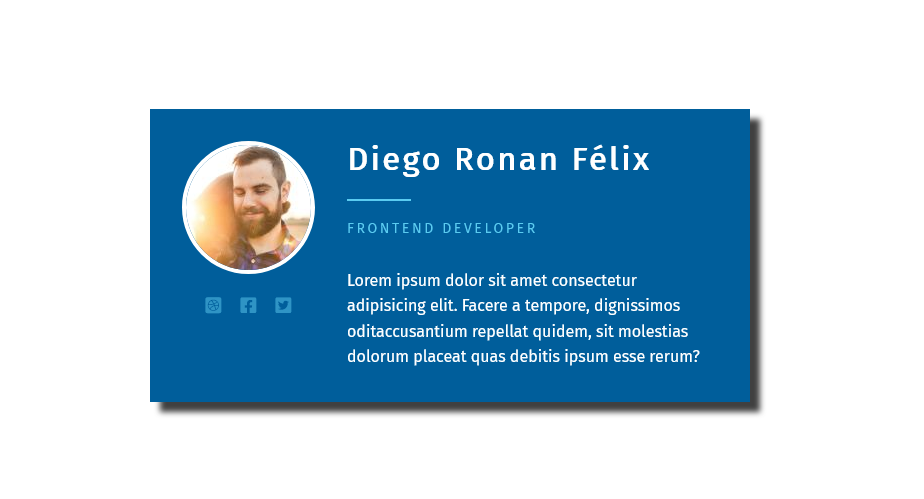

# An awesome responsive card

This is a responsive profile card.

## Table of contents

- [Screenshot](#screenshot)
- [Links](#links)

- [My process](#my-process)
  - [Built with](#built-with)
- [Acknowledgment](#acknowledgment)

### Screenshot

### Links

- Live Site URL: [https://diego-ronan.github.io/responsive-card/](https://diego-ronan.github.io/responsive-card/)

### Built with

- Semantic HTML5 markup
- CSS Flexbox
- Mobile-first workflow

## Acknowledgment

I learned how to create a responsive profile card by watching Professor Kevin Powell.

- Kevin Powell - [https://www.youtube.com/@KevinPowell](https://www.youtube.com/@KevinPowell)
